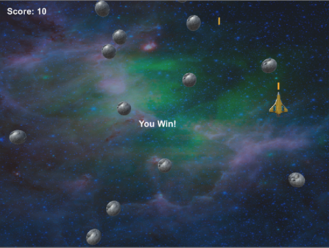

## Introduction

Create a 3D space game using the Unity platform!

### What you will make

With these Sushi Cards you will make a game that is similar to the classic Asteroids game! The player will control a space drone that is flying through an asteroid field and will have to destroy asteroids before they get hit by them. 

### What you will learn

This project covers elements from the following strands of the [Raspberry Pi Digital Making Curriculum](http://rpf.io/curriculum){:target="_blank"}:

- [Apply basic programming constructs to solve a problem](https://curriculum.raspberrypi.org/programming/builder/){:target="_blank"}

### What you will need

A computer with [Unity](https://unity3d.com/){:target="_blank"} installed on it.

--- collapse ---
---
title: How to get Unity
---

- Go to [dojo.soy/getunity](http://dojo.soy/getunity) and click on the **Download Installer** button.

- Run the installer program once it's downloaded, and follow the on-screen instructions, accepting all the default options.

- Wait for the download and installation steps to complete.

- Once the Unity software is installed, you will need to create an account (or sign in if you already have one). This is so that you can access the free version, which is for personal use.

--- /collapse ---

#### Unity version

These Sushi Cards are for Unity version 2017.1, so if you have a different version, the pictures and some of the instructions here might not match exactly.

### Additional information for educators
If you need to print this project, please use the [printer-friendly version](https://projects.raspberrypi.org/en/projects/cd-intermediate-unity-sushi/print){:target="_blank"}.

Use the link in the footer to access the GitHub repository for this project, which contains all resources (including an example finished project) in the 'en/resources' folder.