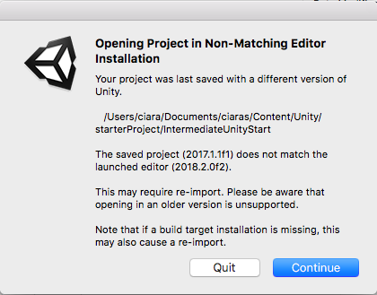

## Introduction

Create a 3D space game using the Unity platform!

### What you will make

With these Sushi Cards you will make a game that is similar to the classic Asteroids game! The player will control a space drone that is flying through an asteroid field. 

--- collapse ---
---
title: What you will learn
---

+ How to use mouse input
+ How to move other objects that aren't your player character
+ How to create and work with clones
+ How to add sounds
+ How to send the game to your friends

--- /collapse ---

--- collapse ---
---
title: What you will need
---

### Hardware

+ A computer (with either Windows or macOS) capable of running Unity

### Software

Unity! These Sushi Cards are for Unity version 2017.1, so if you have a different version, the pictures and some of the instructions here might not match exactly.

+ If you don't have Unity already, you'll need to install itsand get it set up on your computer. This might take a while, as it's a big piece of software.

###How to get Unity

+ Go to [dojo.soy/getunity](http://dojo.soy/getunity) and click on the **Download Installer** button.

+ Run the installer program once it's downloaded, and follow the on-screen instructions, accepting all the default options.

+ Wait for the download and installation steps to complete.

+ Once the Unity software is installed, you will need to create an account (or sign in if you already have one). This is so that you can access the free version, which is for personal use.

### Additional resources

+ Download the starter project from [dojo.soy/IntermediateUnityStarter](http://dojo.soy/IntermediateUnityStarter){:target="_blank"}. This has all of the assets you need to create a game with these Sushi Cards! You won't need to make your own new Unity project, because this creates a project for you.

+ You will need to unzip the file you downloaded and open the project in Unity. Feel free to rearrange the layout of the various tabs and screen areas to suit you! 

### Messages pop up when I try to open the project

Depending on which version of Unity you are using, you might see a message like this when you open the project:

+ Click **Continue** to open the project. If you're using an older version of Unity, you may need to update it before you can open the project.

Also, depending on what operating system you have, you might get a message like this:

+ Simply click **Switch Target** to continue.

### I want different assets than the ones in the download

You can download different assets and use them to change what your game looks like!

+ You might want to find different assets in the Unity Asset Store. In Unity, go to **Window > Asset Store** and click on **Filters** (on the right of the search bar). Now click **FREE ONLY**. 

+ Another option is downloading assets from [dojo.soy/OpenGameArt](http://dojo.soy/OpenGameArt){:target="_blank"}.

--- /collapse ---

### Additional information for educators

Use the link in the footer to access the GitHub repository for this project, which contains all resources (including an example finished project) in the 'en/resources' folder.
