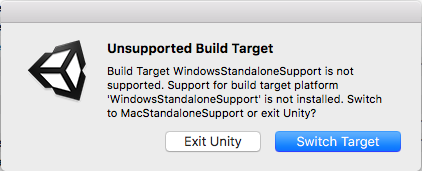

## Getting started

Download the starter project from [dojo.soy/IntermediateUnityStarter](http://dojo.soy/IntermediateUnityStarter){:target="_blank"}. This has all of the assets you need to create a game with these Sushi Cards! You won't need to make your own new Unity project, because this creates a project for you.

--- task ---
You will need to unzip the file you downloaded and open the project in Unity. Feel free to rearrange the layout of the various tabs and screen areas to suit you! 
--- /task ---

--- task ---
Click **Continue** to open the project. If you're using an older version of Unity, you may need to update it before you can open the project.
--- /task ---

Also, depending on what operating system you have, you might get a message like this:

Simply click **Switch Target** to continue.

--- collapse ---
---
title: I want different graphics than the ones in the download
---

You can download different assets (graphics for the ship, asteroids, etc.) and use them to change what your game looks like!

- You might want to find different assets in the Unity Asset Store. In Unity, go to **Window > Asset Store** and click on **Filters** (on the right of the search bar). Now click **FREE ONLY**. 

- Another option is downloading assets from [dojo.soy/OpenGameArt](http://dojo.soy/OpenGameArt){:target="_blank"}.

--- /collapse ---
