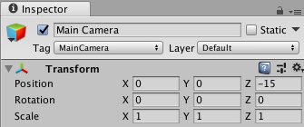
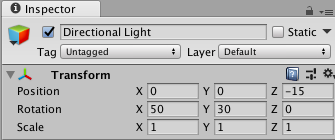
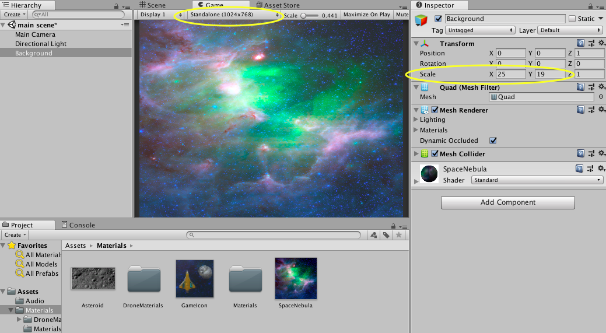
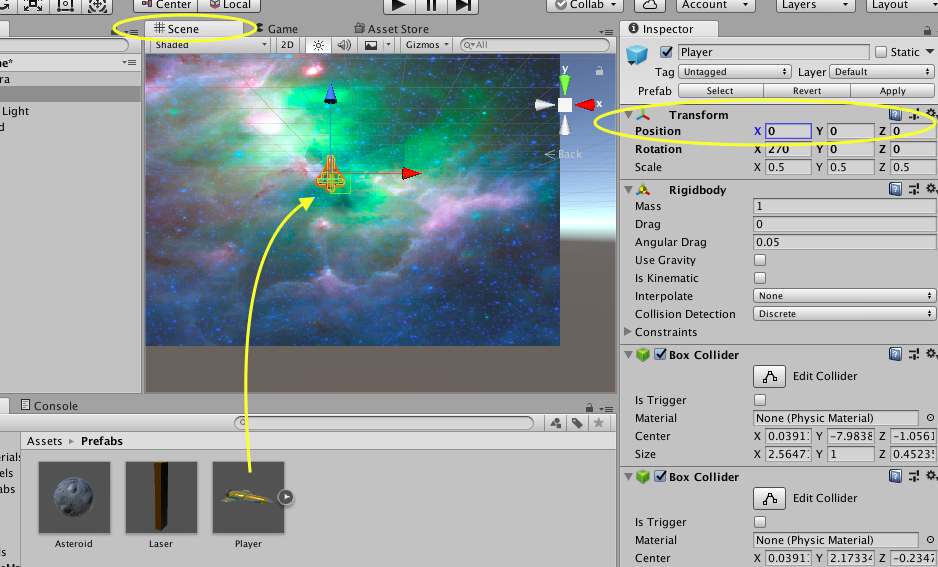
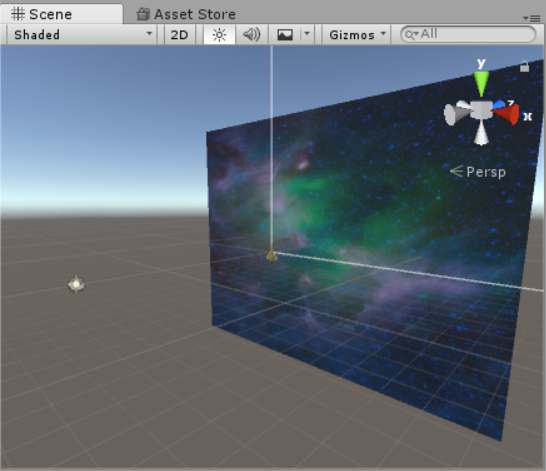

## Creating your game world

Cameras are important in Unity. The camera displays what the player of your game sees. Lights in Unity do exactly what they do in real life. You can move lights around to see objects better.

+ Make sure that the **Transform** of the Main Camera is set to have **Position** `(0, 0, -15)`, and that the **Transform** of the Directional Light is set to have **Position** `(0, 0, -15)`.

+ Create a 3D Object **Quad**,rename it `Background`, and set its **Transform Position** to `(0, 0, 1)`. Make sure its **Rotation** is `(0, 0, 0)`.

+ Drag the "SpaceNebula" image from the `Materials` folder in the Project Viewer and drop it on the `Background` object in the Hierarchy. 

+ Adjust the **Transform Scale** X and Y values of your `Background` until it covers the entire game display. (Make sure it's set to the **Standalone** Aspect Ratio)

Awesome, you have a background! Now lets add something to control!

+ From the `Prefabs` folder, drag and drop the `Player` object (the spaceship!) onto your scene view. Set its **Transform Position** to `(0, 0, 0)`.

Did you notice that the spaceship has a shadow? It doesn't look very good, so you can get rid of it. To select which objects the Directional Light applies to, you use the **Culling Mask** and **Layers** properties of the light.

+ Select Directional Light and in its Inspector, click on the **Layers** drop-down menu in the top right.

+ Select **Add Layer...**. In the first open layer, type `Background`.

+ Go back to the Directional Light Inspector. Click on the **Culling Mask** drop-down menu and select **Everything**. Now deselect the **Background** in the **Culling Mask**. The **Culling Mask** will now say **Mixed...**.

+ Go to your `Background` object's Inspector, select the **Layers** drop-down menu, and set it to the Background layer you just created. Now there will be no more shadow!

To control the game with scripts without attaching them to a 3D object, you can use **Empty Objects**.

+ Create an Empty Object (**GameObject > CreateEmpty**). Name this `Asteroids`. 

+ Create another Empty Object called `Lasers`. 

Your scene should look something like this when it is done. (You can use the icons in the top right-hand corner of the scene to look at it from different angles!)
    

