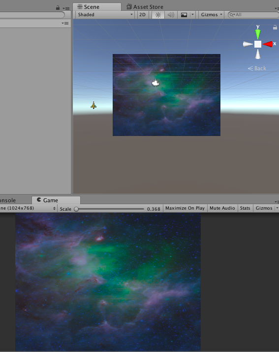

## Move the player

+ Create a folder in your Assets folder and name it `Scripts`. Now create a new C# script in your new folder. When you create a script, you want to know what it does, so give it a descriptive name, for example `PlayerController`.

+ Attach your new script to your `Player` object.

+ Open the script and add this code inside the `Update` function:

```csharp
Vector3 mousePos = Input.mousePosition;  
mousePos.z = 15f;
transform.position = Camera.main.ScreenToWorldPoint(mousePos);
```

--- collapse ---
---
title: What does the code do?
---

A **Vector3**s is a **structure**. A structure stores multiple variables in one unit.

Unity uses Vector3 to keep track of an object's position in the world — its (X, Y, Z) coordinates. So, when you set the **Vector3** equal to the `Input.mouseposition`, the `x` and `y` values of the Vector3 are changed each frame (because it is in the `Update` function).

`Input.mousePosition` doesn't change the `z` value of the Vector3. With the second line of code, you're setting the `z` value by using `.` (called the 'dot operator').

The third line of code moves the `Player` object to the position of the mouse:
* `transform.position` changes the location of your `Player` object
* `Camera.main.ScreenToWorldPoint(mousePos)` sets the position of your `Player` object in the game world

--- /collapse ---

+ Now try to run your game!

What is something that you might want to change about where the `Player` object goes?

--- collapse ---
---
title: Getting a better view
---

It can be helpful to arrange your Unity window so that you can see both the **Scene** tab and the **Game** tab at the same time when you test your game.

In the **Scene** tab, you can change the angle you're viewing from, and zoom out so that you can see objects that go "off the screen". This can be quite usefu, for example when an object is not appearing and you want to work out why, or where it went.



--- /collapse ---
     
+ Did you notice that the `Player` object doesn't stay on the screen? You can fix this by adding this section of code below the code you've already added.
    
```csharp
Vector3 spritePos = Camera.main.WorldToViewportPoint(transform.position);
spritePos.x = Mathf.Clamp(spritePos.x, 0.05f, 0.95f);
spritePos.y = Mathf.Clamp(spritePos.y, 0.1f, 0.9f);
transform.position = Camera.main.ViewportToWorldPoint(spritePos);
```

--- collapse ---
---
title: What does the code do?
---
  
The first line of code here gets the position of our `Player` object.

You can then use the `Mathf` function `Clamp` to keep the `Player` object within the camera's viewpoint. `Clamp` restricts the position of the `Player` object by preventing the values of its X and Y coordinates from exceeding the given values.

--- /collapse ---

Now the `Player` object follows your cursor, but it would be nice to remove the cursor now!

+ Adding this line of code into the `Start` function does will get rid of the cursor:

```csharp
Cursor.visible = false;
```

+ Try running the game and moving the `Player` object with your mouse!
