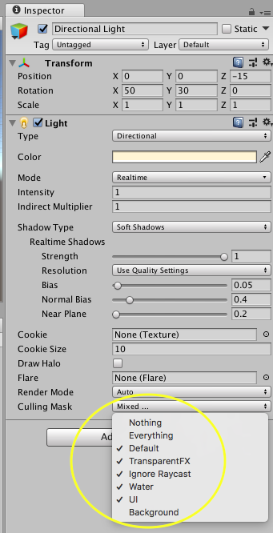

## Creating your game world
The game world in Unity is a bit like making a movie: What the player sees is defined by a camera, which can move around. As the creator of the game you can put objects in front of the camera, add lights to the scene to change how they look etc.

--- task ---
Make sure that the **Transform** of the Main Camera is set to have **Position** `(0, 0, -15)`, and that the Transform of the Directional Light is set to have Position `(0, 0, -15)`.

--- /task ---

--- collapse ---
---
title: What is a transform?
---
The transform of an object in Unity controls its size and location with three properties:
 - Position, which uses three **axes** (`x`,`y`,`z`) to control where the object is positioned.
 - Rotation, which can rotate the object around those three axes in degrees.
 - Scale controls how big the object is.

--- /collapse ---

Your game is going to need a cool background, so start by getting one in place!

--- task ---
Create a 3D Object **Quad**,rename it `Background`, and set its **Transform Position** to `(0, 0, 1)`. Make sure its **Rotation** is `(0, 0, 0)`.
--- /task ---

--- task ---
Drag the 'SpaceNebula' image from the `Materials` folder in the Project Viewer and drop it on the `Background` object in the Hierarchy. 
--- /task ---

--- task ---
Adjust the **Transform Scale** X and Y values of your `Background` until it covers the entire game display. (Make sure it's set to the **Standalone** Aspect Ratio)

--- /task ---

Awesome, you have a background! Now add add something to control!

--- task ---
From the `Prefabs` folder, drag and drop the `Player` object (the spaceship!) onto your scene view. Set its **Transform Position** to `(0, 0, 0)`.

--- /task ---

Did you notice that the spaceship has a shadow? It doesn't look very good, so you can get rid of it. To select which objects the Directional Light applies to, you use the **Culling Mask** and **Layers** properties of the light.

--- task ---
 - Select Directional Light and in its Inspector, click on the **Layers** drop-down menu in the top right.
 - Select **Add Layer...**. In the first open layer, type `Background`.
 - Go back to the Directional Light Inspector. Click on the **Culling Mask** drop-down menu and select **Everything**. Now deselect the **Background** in the **Culling Mask**. The **Culling Mask** will now say **Mixed...**.

 - Go to your `Background` object's Inspector, select the **Layers** drop-down menu, and set it to the Background layer you just created. Now there will be no more shadow!
--- /task ---

To control the game with scripts without attaching them to a 3D object, you can use **Empty Objects**.

--- task ---
 - Create an Empty Object (**GameObject > CreateEmpty**). Name this `Asteroids`. 
--- /task ---

--- task ---
 - Create another Empty Object called `Lasers`. 
--- /task ---

Your scene should look something like this when it is done. (You can use the icons in the top right-hand corner of the scene to look at it from different angles!)
    

