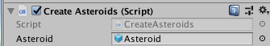
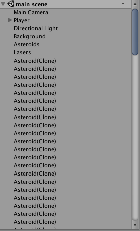
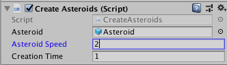

## Creating Obstacles

You'll use a few scripts for your asteroids, so to keep organized it's a good idea to make a folder for them.

+ Make a folder called `Asteroids` inside the Scripts folder. Now, you will need two new C# scripts: `CreateAsteroids` and `DestroyAsteroid`, so go ahead and create those as well.

+ Attach the "CreateAsteroids" script to the Asteroids object and add this code:

```csharp
public GameObject asteroid;
  
void Update()
{
  Vector3 createPosition = Vector3.zero;
  GameObject asteroidClone = Instantiate(asteroid, createPosition, asteroid.transform.rotation);
}
```

--- collapse ---
---
title: What does the code do?
---

To understand what's happening here you need to know what **instantiate** means.

**Instantiating** something is like building something from plans or instructions. If you're baking a cake, the cake is the **instance** and the recipe is the `Instantiate()` function. In the game world, your cake is instead a **GameObject**!

--- /collapse ---

+ Drag the Asteroid prefab from the "Prefabs" folder and drop it into the "asteroid" box for your "CreateAsteroids" script in the **Inspector** for your "Asteroids" object.



+ Save everything (**File > Save Scenes**) and try running your game.

WOAH! That was a lot of asteroids being created! 



The `Update()` function happens really fast so a lot of asteroids get created. You can control how fast the asteroids are created with the `InvokeRepeating()` function. 

+ Add this to your previous code:

```csharp
public float creationTime = 1f;

// Use this for initialization
void Start()
{
  // 0f is when to start invoking repeat
  InvokeRepeating("createAsteroid", 0f, creationTime);
}
```
    
+ Now change `Update()` to `createAsteroid()` and put the "asteroid" prefab into the the script's "asteroid" slot in the "Asteroids" object **Inspector**.

+ Try running the code now, it should create asteroids much slower.

### Cleaning up asteroids

If you create too many objects, your computer wont be able to keep track of them all. So when you create an asteroid you need to make sure it is destroyed. Lets use the `Destroy()` function in the "DestroyAsteroid" script:

+ Attach the "DestroyAsteroid" script to the Asteroids object in the Hierarchy.

+ Add `Destroy(gameObject, 10f);` to the `Start()` function of the script.
 
--- collapse ---
---
title: What does the code do?
---

Your `Start()` function should look like this:

```csharp
void Start () {
  Destroy(gameObject, 10f);
}
```

`gameObject` is the object the script is attached to (i.e. the asteroid clone).

`10f` means the asteroid will get destroyed after ten seconds.
 
--- /collapse ---

### Lets make your asteroids move!

+ Go back to the "CreateAsteroids" script and add this **above** `Start()`:

```csharp
public float asteroidSpeed;
```

+ Change the `createAsteroid()` function so that it looks like this:

```csharp
void createAsteroid () {
  Vector3 createPosition = Vector3.zero;
  GameObject asteroidClone = Instantiate(asteroid, createPosition, asteroid.transform.rotation);

  // make the asteroid move
  Rigidbody asteroidCloneRB = asteroidClone.GetComponent<Rigidbody>();
  asteroidCloneRB.velocity = -(transform.up * asteroidSpeed);
}
```

--- collapse ---
---
title: What does the code do?
---

To make the asteroid move, you need to give it a velocity, and to do this you need to get the asteroid's **Rigidbody**.

The line

```csharp
Rigidbody asteroidCloneRB = asteroidClone.GetComponent<Rigidbody>();
```

looks at the asteroid clone you just created and gets its **Rigidbody**.

In the last line, you changed the **Rigidbody**'s **velocity** (the speed) property. `-(transform.up)` is the direction to move.

--- /collapse ---

+ Back in Unity, click on the "Asteroid" object in the Hierarchy and set "asteroidSpeed" to `2` in the script section of the Inspector. 

 

### Randomising where the asteroids appear

Lets make it more fun by creating asteroids at different locations. You can make a function that returns a random position to do this!

+ Add this function to the "CreateAsteroids" script:
  
```csharp
Vector3 getRandomPosition()
{
    float xPos = Random.Range(.05f, .95f);
    Vector3 randomPosition = Camera.main.ViewportToWorldPoint(new Vector3(xPos, 1.1f, 15f));
    return randomPosition;
}
```

--- collapse ---
---
title: What does the code do?
---

  Putting `Vector3` instead of `void` in front of a function declaration means that the function will return a **Vector3** object. 
  
  `Random.Range(.05f, .95f)` returns a random number between the two numbers given in the **parameters** (a parameter is anything in the parenthesis following a function), in this case that will be a random number in between `0.05` and `0.95`. 
    
  The camera's viewport dimensions are `1` by `1` (the bottom left being `(0,0)` and the top right being `(1,1)`). 
  
  You then create a **Vector3** to return called `randomPosition` and set the `randomPosition` to
  x: our randomly generated x position
  y: a y position that creates the asteroids above the screen
  z: the z position that is level with your player object
  
--- /collapse ---

+  Finally, change `Vector3 createPosition = Vector3.zero;` to `Vector3 createPosition = getRandomPosition();`.
 
+ Try the game out!