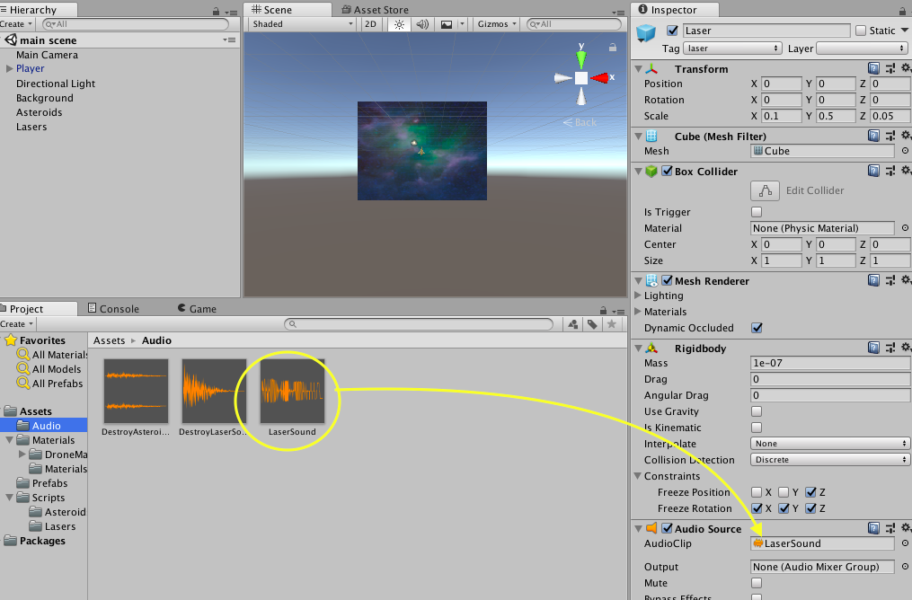

## Creating Projectiles

+ Create a new folder called `Lasers` (make sure its in the "Scripts" folder). Now create two C# scripts:  `CreateLasers` and `DestroyLaser`.

### Firing lasers

+ Start with creating a laser. Attach the "CreateLasers" script to the "Lasers" **GameObject**. Add this code: 
    
```csharp
public GameObject laser;
public GameObject player;

void Update(){
    if (Input.GetMouseButtonDown(0))
    {
    Vector3 createPosition = player.transform.position;
    createPosition.y += 1f;
    // Create a laser clone
    GameObject laserClone = Instantiate(laser, createPosition, transform.rotation); 
    }
}
```
  
--- collapse ---
---
title: What does the code do?
---

Notice this looks similar to the obstacle that you just created. You've added an `if` statement so that this block of code only runs when the player left clicks.

`player.transform.location` is the center of the player **GameObject**. 

You don't wan't to create the laser inside of the spaceship so adding 1 to the y value will stop that. 

You might not have seen this operator before `pos.y += 1f;`. Coders are pretty lazy and using these "shorthand" operators allow us to shorten code. `a += b` is the same as ` a = a + b`, but notice how much shorter the first one is! Here is a list of the shorthand operators in C#: [dojo.soy/CSharpShortOps](http://dojo.soy/CSharpShortOps).

--- /collapse ---

With this code, left clicking the mouse is the trigger for firing a laser.

+ If you want, try to allow the player to fire a laser when they press a different button like the spacebar. You can find other input options here: [dojo.soy/CSharpInputs](http://dojo.soy/CSharpInputs).

+ Now, just attach the "Laser" prefab and "Player" **GameObject** to the script.
  
### Getting the lasers to move

+ Go back to the "CreateLasers" script and above `Start()` add

```csharp
public float laserSpeed;
```

+ Add the following code to the end of `Update()` (so, underneath the line `GameObject laserClone = Instantiate(laser, createPosition, transform.rotation);`):

```csharp
// Make the clone move
Rigidbody laserRB = laserClone.GetComponent<Rigidbody>();
laserRB.velocity = transform.up * laserSpeed;
```

--- collapse ---
---
title: What does the code do?
---

Just like with the asteroids, you need to access the laser's **Rigidbody** to set its velocity.

The code `laserClone.GetComponent<Rigidbody>()` gets the **Rigidbody** so that you can then set the velocity on the next line.

--- /collapse ---

+ Back in Unity, click on the "Laser" object in the Hierarchy and set "laserSpeed" to `20` in the script section of the Inspector.
    
+ Try out your lasers now!

Lasers make sounds, right? Lets add a sound to this laser.

+ Click on the laser in the "Prefabs" folder and add an **AudioSource** component (**Component > Audio > Audio Source**).

+ From the "Audio" folder in "Assets", drag "LaserSound" into the **Audio Clip** property in the "Laser" prefab **Inspector**.



If you run the game you can test the lasers out!
