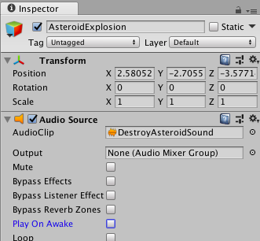

## Detecting Collisions

You have all the components of your game working now. Awesome, but... they don't do anything when they **collide**. **Colliding** is when two objects touch each other. You need to detect the **collision** between the game's objects and write some scripts that do something when a **collision** is detected.

+ Before you start, tagging the asteroid prefab will be helpful. Tag the asteroid prefab with "asteroid". Also take this step to attach the "DestroyLaser" and "DestroyAsteroid" scripts to their game objects if you haven't already done so.

### Lasers colliding with asteroids

+ Open the C# script called "DestroyLaser". Add the following code to the script:

```csharp
public void OnCollisionEnter(Collision col)
{
    if (col.gameObject.CompareTag("Asteroid"))
    {
    // Destroy both objects
    Destroy(col.gameObject);
    Destroy(gameObject);
    }
}
```
  
+ Now open the "CreateLasers" script and add the following line underneath `GameObject laserClone = Instantiate(laser, createPosition, transform.rotation);`

```csharp
laserClone.AddComponent<DestroyLaser>();
```

--- collapse ---
---
title: What does the code do?
---

`OnCollisionEnter(Collision col)` is a built in function that is called when the object the script is attached to and another object collide.

Within this function you have two **GameObjects** `col.gameObject` and `gameObject`. `gameObject` is what the script is attached to (the laser clone) and `col.gameOBject` is the thing colliding with the laser (the asteroid). 

`col.gameobject.name` returns the name of the object the laser collided with.

The `if` statement is to make sure that if the laser collided with an asteroid (which will be tagged "asteroid"), then the two objects will be destroyed.

Finally, you need to attach the "DestroyLaser" script to each new **instance** of the laser game object. You do this in the "CreateLasers" script, after instantiating the clone:

```csharp
GameObject laserClone = Instantiate(laser, createPosition, transform.rotation);
laserClone.AddComponent<DestroyLaser>();
```

--- /collapse ---

Since you're destroying asteroids, you could make it play a sound!

+ Create an **Empty** (**GameObject > Create Empty**) and call it "AsteroidExplosion".

+ Add an **AudioSource** component to the Empty. Open up the "Audio" Assets folder and drag and drop the "DestroyAsteroidSound" sound into the "AsteroidExplosion" **Inspector** for "Audio Clip". 

+ Finally, uncheck the "Play On Awake" property. 



+ To play the **AudioSource** some code needs to be added into the `if` statement you made above.

```csharp
AudioSource audio = GameObject.Find("AsteroidExplosion").GetComponent<AudioSource>();
audio.Play();
```

--- collapse ---
---
title: What does the code do?
---

The first line finds the game object you made.

The second line tells the game object to play the sound that you added to the **AudioSource**.

--- /collapse ---

### Collisions with the player

Now you can detect a collision with an asteroid and the laser, but not your "Player" **GameObject** and an asteroid.

+ Add this code to your "PlayerController" script under the `Update()` function:

```csharp
void OnCollisionEnter(Collision col)
{
    if(col.gameObject.name == "Asteroid(Clone)")
    {
        Destroy(gameObject);
        Destroy(col.gameObject);
    }
}
```

--- collapse ---
---
title: Understanding the code
---

Do you know what the `gameObject` is here?

It is your "Player" object because your script is attached to the "Player" object. 

That means the `col.gameObject` is an asteroid.

--- /collapse ---

Let's play a different noise if the player collides with an asteroid.

+ Create another **Empty** and call it "PlayerExplosion".

+ Add an **AudioSource** and add the "DestroyPlayerSound" sound to it.

+ Finally, add this code to the `OnCollisionEnter()` function in the "Player" script.

```csharp
AudioSource audio = GameObject.Find("PlayerExplosion").GetComponent<AudioSource>();
audio.Play();
```
   
+ Try shooting after you run into an asteroid! 

You have detected collisions between all of the objects in your game, but did you notice the bug? If you have the time after you finish these Sushi Cards you can try to fix the bug!

    
    