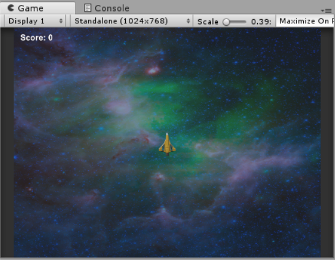

## Display the score

The **Graphical User Interface (GUI)** is how your game can display information to the player. You're going to add a score to your game and make the player win or lose.

+ Add `using UnityEngine.UI;` to the top of the "PlayerController" and "DestroyLaser" scripts.

+ Create an **UI Text** element (**GameObject > UI > Text**) and rename it `Score`.

+ In the "Score" **Inspector** there is a text box in the **Text (Script)** section. Change the text to `Score: 0`. This also added an object to your hierarchy called a **Canvas**, this is where all of your GUI elements will be displayed.

+ Play around with the other properties in **Text (Script)**. Make sure you change the color to something that will show up on your background (white works well) and set the **Font Size** to `27`.

If you check the Game View you will be able to see where the score will be displayed. It's in the center, but you can move it to a better spot.

+ Use the text element's **Rect Transform** in the **Inspector** to move the score into the corner of the screen (change the **x** and **y** values to move it into place).



Now that you have a place to display the score, you need to update the score. You want to update the score when a laser collides withan asteroid. The code that detects that collision is in the "DestroyLaser" script. However, you need a variable to keep track of the player's score. The score can't be put in the "DestroyLaser" script because it will be destroyed every time the laser it is attached to is destroyed. The "Player" object is active until the end of the game, so you can store the score there.

+ Add this to the "PlayerController" script, above `Start()`. 
   
   ```csharp
   public int score;
   ```

   and inside the `void Start()` function add:
   
   ```csharp
   score = 0;
   ```

--- collapse ---
---
title: Why do you need the word 'public'?
---

You may have seen the keywords **public** and **private** in your time with Unity. 

These keywords are **Access Modifiers**, and they (as you probably guessed) set the access level of a type or member that they modify.

For example, if you have a variable, adding **public** means that any code in your project can access the variable. Adding **private** means the variable can be only accessed from code inside of the same class.

If you don't put an **Access Modifier**, by default they will be **private**. 

--- /collapse ---
   
Now that you have a variable to change, you can update the score in the `OnCollisionEnter()` function of the "DestroyLaser" script. First you need to make sure you can get the score from the "PlayerController" script.

+ In the "DestroyLaser" script, add `PlayerController playerScript;` and `Text displayedScore;` above `Start()`.

+ Now add this to the `Start()` function:

```csharp
playerScript = GameObject.Find("Player").GetComponent<PlayerController>();
displayedScore = GameObject.Find("Score").GetComponent<Text>();
```
    
+ Finally, add this to the `OnCollisionEnter()` function:

```csharp
playerScript.score += 1;
displayedScore.text = "Score: " + playerScript.score.ToString();
```
    
--- collapse ---
---
title: What does the new code do?
---

The first part is how you access the public score variable you made in the Player class. It means find the "Player" object and get the "PlayerController" script. 

You access the score with the **dot operator** and add one to the score. `displayedScore.text` is the text that is displayed to the screen for the players score. **ToString()** just converts the score, which is a number, into a string so it can be displayed. 

--- /collapse ---

+ Add a new **UI Text** element to your canvas and call it "WinOrLose". Make the text style match your score's text style, then remove all the text from the text box. Change the width of the **Rect Transform** to `200`, and change the **x** and **y** position both the `0` to place it in the centre of the screen.

Now you are going to update the "PlayerController" script so that it updates the "WinOrLose" text based on the player losing or winning your game. Since the code will be the same for losing and winning you can create a **function** so that you don't have duplicate code.

+ Add `Text endgameText;` above the `Start()` function in your "PlayerController" script.

+ In the `Start()` function use `endgameText = GameObject.Find("WinOrLose").GetComponent<Text>();` to find the Text **GameObject**.

+ Finally, create a function with this code (add it after the `OnCollisionEnter` function:

```csharp
void endGame(string text)
{
    endgameText.text = text;
    Time.timeScale = 0;
}
```

--- collapse ---
---
title: How does the new function work?
---

This **function** requires a **parameter**. This way you can display any text when the function is called.

`Time.timeScale` is the speed the game is running at... setting it to `0` stops time in the game.

--- /collapse ---
    
The last step to have your player win or lose is **calling** (running the code in a function) the function you just added.

+ The player loses when they collide with an asteroid, so you should **call** the `endGame()` function in the `OnCollisionEnter()` function.

```csharp
endGame("GAME OVER");
``` 
 
To make the player win, you can add an if statement in the `Update()` function that checks if the score is equal to a number. When the player reaches that number they will win!
 
+ Add this if statement to the `Update()` function, changing `10` to whatever number you want the player to get to so that they win:

```csharp
if (score == 10)
{
    endGame("You Win!");
}
```

Your player can now win and lose, and they will get a message when they do!
    
    