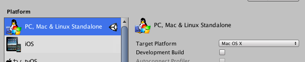
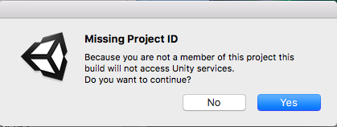

## Sharing Your Game

Only people have who have Unity can play your game right now. You can **build** (package your game up) your project so that you can send it to your friends to try out. 

When you build your game, you are creating an **executable file** for the specific system that you choose. That could be PC, Mac, or Linux. Or it could be on a mobile device!

--- task ---
+ To build a game go to **File > Build Settings**

+ In the **Platform** menu make sure PC, Mac, Linux Standalone is selected. Make sure the **Target Platform** is the operating system you're using on your computer.

+ Click **Player Settings** in the bottom right. This will bring up the Player Settings in the **Inspector**. Put your nickname (or have fun and make up your own company name) in for the **CompanyName** and make a game name for the **Product Name**. You can also set the **Default Icon** to the "GameIcon". 

+ Back in the **Build Settings** click **Build and Run**. Save your game as anything you want (we used `UnityIntermediateSushi`). Make sure you remember the location you save it to (it's a good idea to put it in its own new folder) so you can find it later!

+ If a message pops up about accessing Unity services, just click "Yes" to continue.

+ A window should pop-up with some settings. Make sure the **resolution** is the same as the resolution you used in your standalone **Game View** in Unity. Also make sure **Windowed** is checked!
--- /task ---

--- task ---
Click **Play!** and try it out!
--- /task ---

All you need is to give your friends the files and folders that were created in the folder you saved the game to and they can play your new game! Our file and folder were called `UnityIntermediateSushi.exe` and `UnityIntermediateSushi_Data` for Windows. For Mac there was just a file called `UnityIntermediateSushi.app`, and no folder.